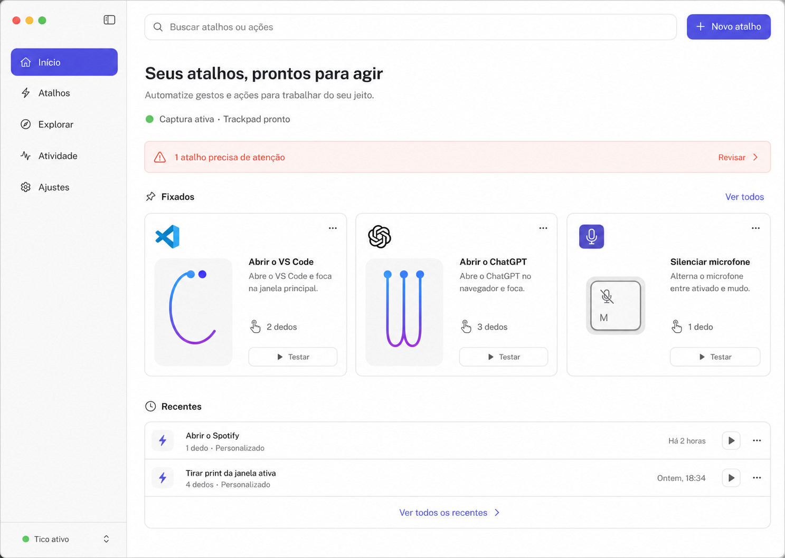
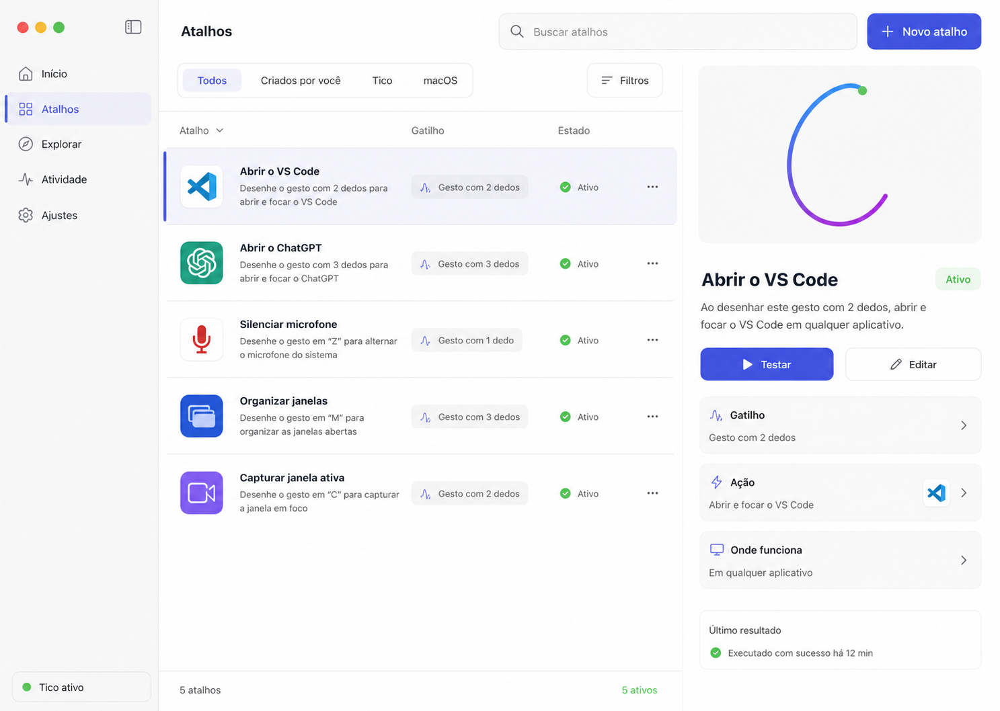
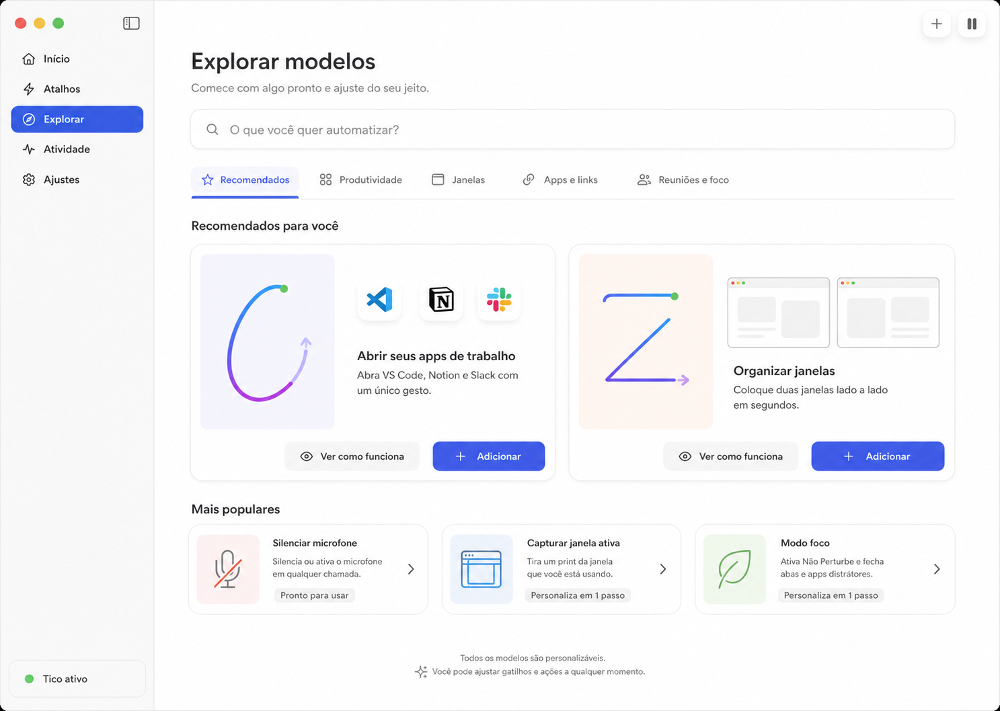
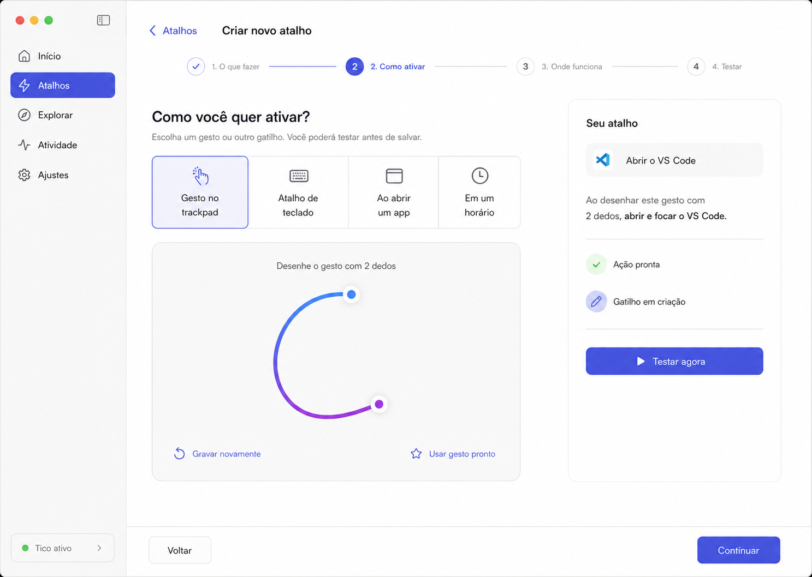
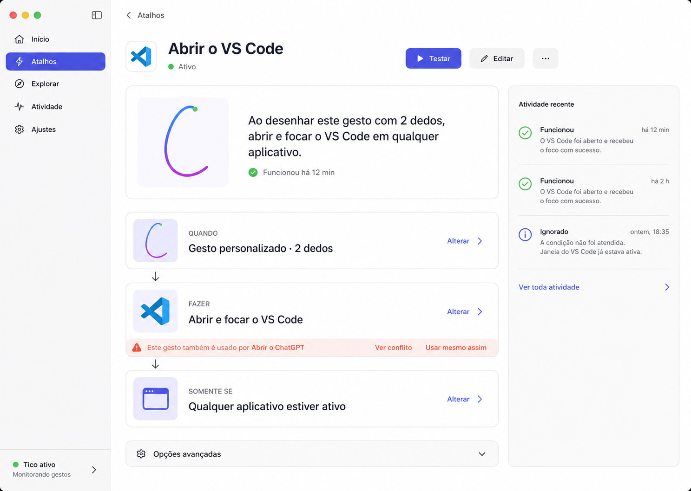
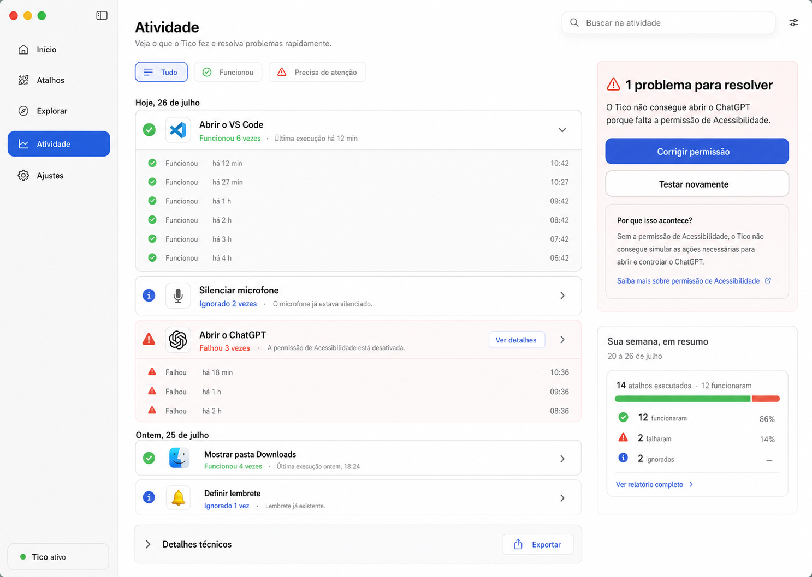
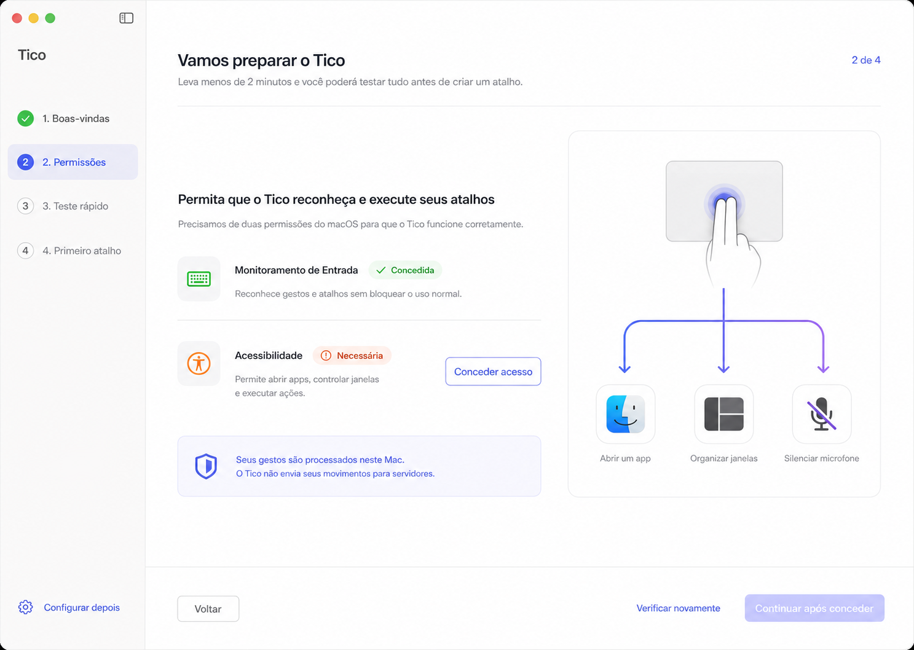
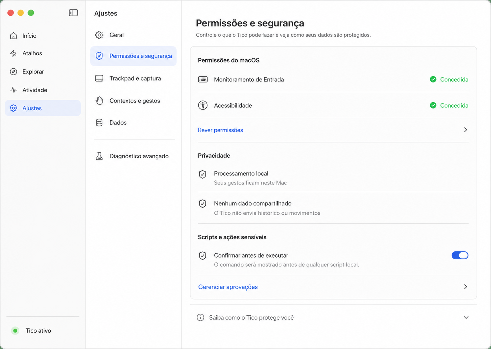

# Propostas visuais do Tico

Data: 26 de julho de 2026  
Formato: mockups conceituais para desktop macOS  
Dimensão gerada: 1487 × 1058 px  
Ferramenta: geração de imagens integrada do Codex

## Direção visual

**Tico Inteligente** combina a familiaridade de um aplicativo nativo do macOS com uma experiência mais visual e autoexplicativa.

- Atalhos são o centro do produto.
- Gestos funcionam como assinatura visual.
- A interface usa linguagem natural antes de conceitos técnicos.
- Cada tela tem uma ação principal evidente.
- Configurações avançadas aparecem somente quando necessárias.
- Estados combinam ícone, texto e cor.
- A navegação principal tem apenas cinco destinos: Início, Atalhos, Explorar, Atividade e Ajustes.

## 1. Início

Transforma a Home em um painel dos atalhos fixados e recentes. O usuário consegue entender, testar e revisar seus atalhos sem entrar em uma tela técnica.

## 2. Atalhos

Combina uma lista eficiente com um inspetor visual. A tela permite buscar, filtrar, testar e editar sem perder o contexto do item selecionado.

## 3. Explorar

Apresenta modelos prontos por objetivo, com prévia do gesto, explicação do resultado e indicação simples do esforço de personalização.

## 4. Criação guiada

Divide a criação em quatro decisões: o que fazer, como ativar, onde funciona e testar. Um resumo em linguagem natural acompanha todo o processo.

## 5. Detalhe do atalho

Resume a automação em Quando, Fazer e Somente se. O teste é a ação principal, o histórico fica contextual e conflitos são apresentados sem interromper o fluxo.

## 6. Atividade

Substitui métricas e logs separados por um histórico agrupado, com causas compreensíveis e ações diretas para corrigir problemas.

## 7. Configuração inicial

Conduz o primeiro acesso em quatro etapas curtas. As permissões explicam o benefício desbloqueado e reforçam que os gestos são processados localmente.

## 8. Ajustes

Consolida permissões, segurança, trackpad, contextos, dados e diagnóstico. O Laboratório permanece disponível, mas dentro de Diagnóstico avançado.

## Prompt set

Todas as telas foram geradas com o mesmo sistema:

- UI realista e pronta para produção, sem aparência de concept art.
- Janela completa de aplicativo macOS em proporção aproximada de 1440 × 1024.
- Tipografia semelhante à SF Pro e ícones semelhantes aos SF Symbols.
- Conteúdo branco quente, sidebar cinza-clara, índigo como ação principal, coral para atenção e verde para sucesso.
- Separação por espaçamento, alinhamento e divisores antes de bordas e sombras.
- Texto em português, tamanho de corpo equivalente a 14–16 px e sem identificadores técnicos.
- Referências visuais anexadas: screenshots reais do Tico correspondentes a cada área.
- Restrições comuns: sem dark mode, glassmorphism, dashboards genéricos, cards dentro de cards, marcas d'água ou excesso de métricas.

O foco específico de cada geração foi:

1. **Início:** atalhos fixados, recentes, busca global, estado compacto e uma pendência acionável.
2. **Atalhos:** lista com filtros, inspetor, resumo em linguagem natural e ação Testar.
3. **Explorar:** modelos por objetivo, prévias de gestos e adoção em poucos passos.
4. **Criação guiada:** uma decisão por etapa, gravação visual do gesto e resumo ao vivo.
5. **Detalhe:** blocos Quando/Fazer/Somente se, teste prioritário, histórico e conflito contextual.
6. **Atividade:** execuções agrupadas, explicação de falhas, correção direta e detalhes técnicos recolhidos.
7. **Configuração inicial:** progresso curto, permissões orientadas a benefício, privacidade local e teste rápido.
8. **Ajustes:** arquitetura consolidada, estados verificáveis de privacidade e diagnóstico avançado secundário.

## Observação

As imagens definem direção visual e hierarquia de produto. Antes da implementação, componentes, textos, estados de foco, contraste, VoiceOver e comportamento responsivo da janela devem ser normalizados em um design system ou arquivo de design editável.
